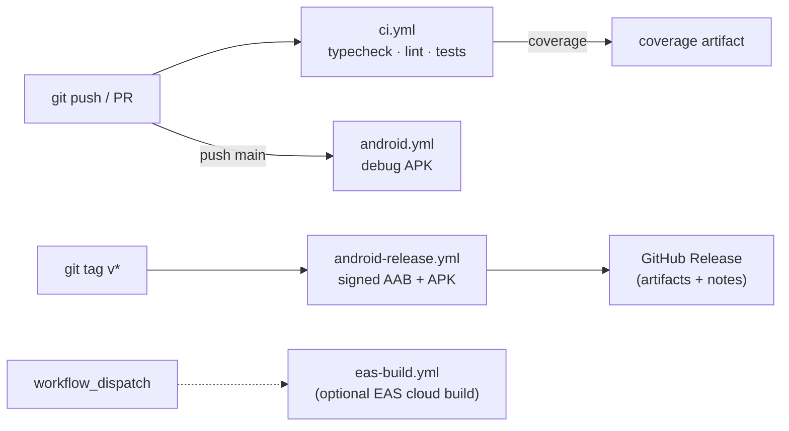

# Kimacha

[](https://github.com/kalmi91/kimacha/actions/workflows/ci.yml)
[](https://github.com/kalmi91/kimacha/actions/workflows/android.yml)

A mobile language-learning app (Expo / React Native) with spaced-repetition
flashcards, sentence-ordering and typing cards, and per-level placement exams.
Multilingual UI (hu / en / es / de).

## Tech stack

- **Expo SDK 56** / React Native 0.85 / React 19 / TypeScript
- **expo-router** (file-based navigation), **expo-sqlite** (local store)
- **ts-fsrs** spaced-repetition scheduling

## Development

```bash
npm install
npm start          # Expo dev server
npm run android    # run on a device/emulator
npm test           # Jest (jest-expo) unit + component tests
npm run lint       # eslint (expo config)
npm run typecheck  # tsc --noEmit
```

## DevOps / CI-CD

Production-grade pipeline running entirely on GitHub Actions' free tier — lint,
typecheck and tests on every push/PR; signed release builds and GitHub Releases
on `v*` tags. Local Gradle builds keep CI at $0; EAS is available as an optional
cloud path.



### Workflows

| Workflow | Trigger | What it does |
| --- | --- | --- |
| `ci.yml` | push / PR | typecheck (full project) + lint + **Jest tests** (+ coverage artifact); concurrency-cancels superseded runs |
| `android.yml` | push to `main`, manual | Expo prebuild → **debug APK** via Gradle → artifact |
| `android-release.yml` | `v*` tag, manual | prebuild → release build → **sign** (apksigner APK + jarsigner AAB) → on a tag, publish a **GitHub Release** with the artifacts |
| `eas-build.yml` | manual | optional **EAS** cloud build (profile choice); EAS manages signing |

### Tests

`jest-expo` preset. Pure-logic suites (`lib/__tests__/`) plus a component render
test (`components/__tests__/`). Run locally with `npm test`, in CI with
`npm run test:ci` (coverage).

### Release process

The APK is built locally by the maintainer and distributed by hand. `android/`
is not in this repository (it is hand-maintained, not generated, because
`expo prebuild` would replace the signing keystore) and the signing key exists
on one machine, so `android-release.yml` is manual-dispatch only.

Turning the automated path back on needs two things: the `android/` project in
the repository, and the four signing secrets (`ANDROID_KEYSTORE_B64`,
`ANDROID_KEYSTORE_PASSWORD`, `ANDROID_KEY_ALIAS`, `ANDROID_KEY_PASSWORD`) under
Settings, Secrets and variables, Actions. The workflow header says the same.

### Contributing

`.github/CONTRIBUTING.md` has the branch, gate and review rules.
`docs/NORTH-STAR.md` has the product rules the code is built to, and is worth
reading before a first change.
